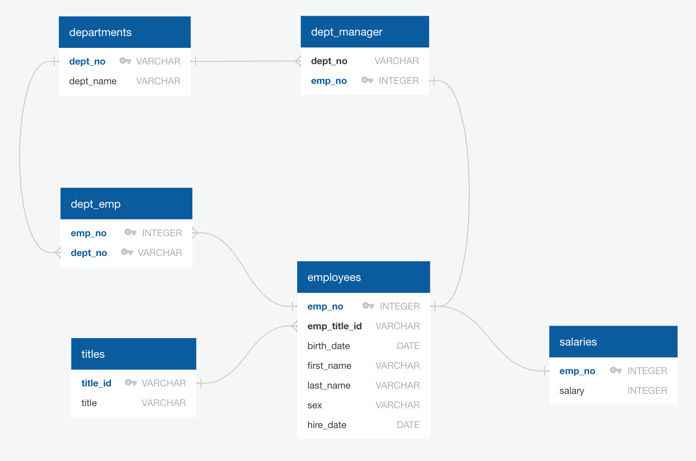
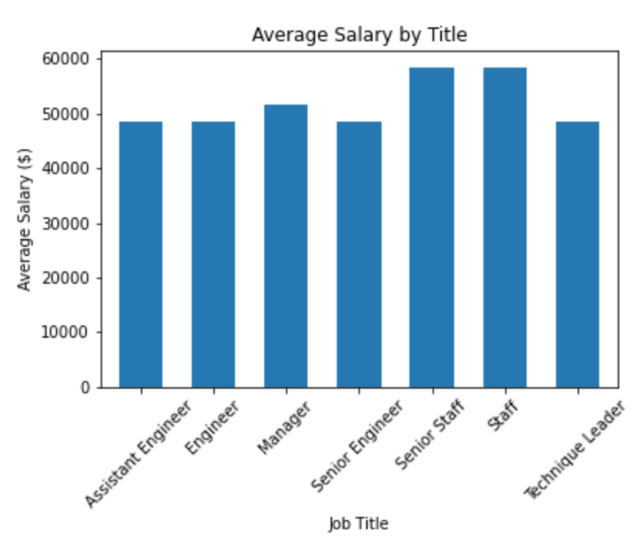

# Employee Database: A Mystery in Two Parts

## Introduction
The main task for this challenge is perform data engineering & data analysis on the employees' data in the corporation from the 1980s and 1990s.
Includes to design the tables to hold data in the CSVs, import the CSVs into a SQL database, and answer questions about the data.

## Data Modeling
Sketch an ERD of the tables (the six CSVs).

## Data Engineering
* Create a table schema for each of the six CSV files in PostgreSQL and import each CSV file into the corresponding SQL table.

#### Data Analysis
Run the following analysis with the imported data in PostgreSQL:
1. List the following details of each employee: employee number, last name, first name, sex, and salary
2. List first name, last name, and hire date for employees who were hired in 1986
3. List the manager of each department with the following information: department number, department name, the manager's employee number, last name, first name
4. List the department of each employee with the following information: employee number, last name, first name, and department name
5. List first name, last name, and sex for employees whose first name is "Hercules" and last names begin with "B."
6. List all employees in the Sales department, including their employee number, last name, first name, and department name
7. List all employees in the Sales and Development departments, including their employee number, last name, first name, and department name
8. In descending order, list the frequency count of employee last names, i.e., how many employees share each last name

Import the SQL database into Pandas and create the below visualisations:
1. A histogram to visualize the most common salary ranges for employees

2. Create a bar chart of average salary by title

## Tools
* Pandas
* Matplotlib
* PostgreSQL

## Copyright

Trilogy Education Services © 2019. All Rights Reserved.

